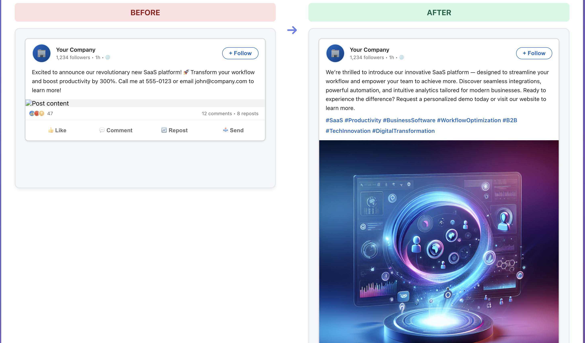
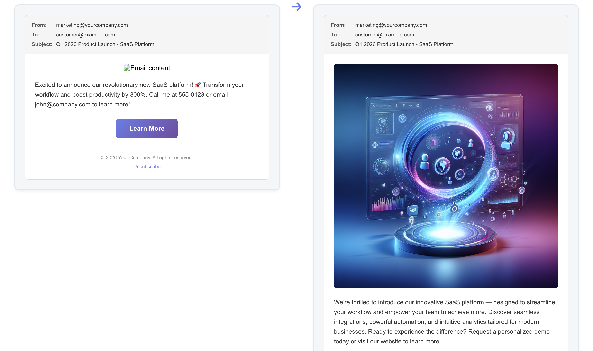

# 🛡️ AgentGuard - AI-Powered Marketing Content Guardian

<div align="center">


**Your AI co-pilot for marketing content that's safe, compliant, and optimized for engagement**

[View Demo](#-see-it-in-action) · [Quick Start](GETTING_STARTED.md) · [Architecture](ARCHITECTURE.md)

</div>

---

## 🎯 The Problem

Marketing teams face a critical challenge: **How do you ensure your content is safe, compliant, and effective before it goes live?**

❌ **Manual review is slow and error-prone**  
❌ **PII leaks can cost millions in fines**  
❌ **Platform violations lead to account suspensions**  
❌ **Poor audience fit means wasted ad spend**  
❌ **AI-generated content lacks oversight**

**Traditional solutions:** Hire more reviewers, use basic keyword filters, pray nothing goes wrong.

**The AgentGuard solution:** An intelligent, multi-agent AI system that reviews your content in seconds with expert-level precision.

---

## 💡 What is AgentGuard?

AgentGuard is a **comprehensive AI-powered review platform** that analyzes marketing content through **4 specialized AI agents working in concert** to ensure your content is:

✅ **Safe** - No PII leaks or sensitive data exposure  
✅ **Compliant** - Adheres to platform-specific rules and regulations  
✅ **Optimized** - Perfect audience fit with actionable improvements  
✅ **Enhanced** - AI-generated rewrites that perform better

Think of it as having a team of expert reviewers—a security specialist, a compliance officer, an audience analyst, and a creative director—reviewing every piece of content in **under 10 seconds**.

---

## 🚀 Why AgentGuard?

### **For Marketing Teams**
- ⚡ **10x faster review process** - Seconds instead of hours
- 🎯 **Reduce compliance risks** - Catch violations before they go live
- 📈 **Improve campaign performance** - Get actionable suggestions with every review
- 🤖 **Validate AI outputs** - Trust but verify your AI content generation

### **For Businesses**
- 💰 **Prevent costly mistakes** - GDPR/CCPA violations can cost up to €20M
- 🔒 **Protect your brand** - No more embarrassing PII leaks
- 📊 **Data-driven decisions** - Comprehensive scoring and analytics
- 🚀 **Scale with confidence** - Review 1000s of pieces without hiring more staff

### **For Developers**
- 🔌 **Simple REST API** - Integrate into existing workflows
- 🛠️ **Extensible architecture** - Add custom rules and agents
- 📝 **Complete documentation** - Get started in minutes
- 🔧 **Modern tech stack** - Node.js, React, OpenAI GPT-4

---

## 🎬 See It in Action

### 🎥 Full Demo Video

**[▶️ Watch the Complete Walkthrough](https://zetaworld-my.sharepoint.com/:v:/r/personal/yashsa_zeta_tech/Documents/Microsoft%20Teams%20Chat%20Files/Screen%20Recording%202026-02-03%20at%2010.43.38%E2%80%AFPM%201.mov?csf=1&web=1&e=gAtVO3&nav=eyJyZWZlcnJhbEluZm8iOnsicmVmZXJyYWxBcHAiOiJTdHJlYW1XZWJBcHAiLCJyZWZlcnJhbFZpZXciOiJTaGFyZURpYWxvZy1MaW5rIiwicmVmZXJyYWxBcHBQbGF0Zm9ybSI6IldlYiIsInJlZmVycmFsTW9kZSI6InZpZXcifX0%3D)**

*See AgentGuard in action - full platform demo with all features*

Screenshots:





---

## 🤖 Meet the AI Agent Team

### **1. AEGIS** - The PII Guardian 🛡️
**Mission:** Detect and protect sensitive personal information

- Identifies 10+ types of PII (emails, phones, SSN, credit cards, addresses, names)
- Provides redacted versions for safe review
- Zero PII storage - privacy by design

### **2. SENTINEL** - The Compliance Officer ⚖️
**Mission:** Ensure platform rule adherence

- 5+ platform rulesets (LinkedIn, Instagram, Twitter, Facebook, TikTok)
- Character limits, prohibited words, hashtag requirements
- Violation severity scoring with detailed explanations

### **3. PULSE** - The Audience Analyst 📊
**Mission:** Optimize content for maximum engagement

- Demographic alignment scoring
- Interest and regional fit analysis
- Engagement potential prediction
- Optimal posting time recommendations

### **4. CREATIVE** - The Content Enhancer ✨
**Mission:** Generate better performing content

- 3-5 improved content versions
- Smart hashtag recommendations
- Tone and style optimization
- Performance scoring for each variant

---

## ⚡ Key Features

| Feature | Description | Impact |
|---------|-------------|--------|
| **Real-Time PII Detection** | Catch sensitive data before it leaks | Prevent GDPR/CCPA fines |
| **Multi-Platform Compliance** | Rules for 5+ social platforms | Avoid account suspension |
| **Audience Fit Scoring** | AI-powered demographic analysis | Increase engagement rates |
| **Content Rewrites** | 3-5 AI-generated improved versions | Boost campaign performance |
| **Comprehensive Scoring** | Overall safety & effectiveness score | Data-driven decisions |
| **Audit Logging** | Full trail of all reviews | Compliance documentation |
| **REST API** | Simple integration | Use anywhere |
| **Modern UI** | Beautiful, responsive interface | Delightful user experience |

---

## 🎯 Real-World Use Cases

### **1. Marketing Campaign Launch**
Review 100+ pieces of content across platforms before launch day. Catch compliance issues, optimize for each audience segment, and ensure zero PII leaks.

### **2. AI Content Generation Validation**
Your AI generates marketing copy at scale. AgentGuard validates every piece, ensuring quality, compliance, and safety before it reaches customers.

### **3. Social Media Management**
Daily content scheduling across multiple platforms. AgentGuard ensures each post meets platform requirements and is optimized for the target audience.

### **4. Training & Quality Assurance**
New team members learn best practices through real-time feedback. Establish quality standards with automated scoring.

### **5. Incident Prevention**
Catch that email address in the Instagram post, that GDPR violation in the EU campaign, or that audience mismatch before it costs you.

---

## 🏗️ How It Works

```
┌─────────────┐
│   Content   │
│   Input     │
└──────┬──────┘
       │
       ▼
┌─────────────────────────────────────────────┐
│          AgentGuard Pipeline                │
│  ┌────────┐  ┌────────┐  ┌────────┐  ┌────────┐  │
│  │ AEGIS  │→ │SENTINEL│→ │ PULSE  │→ │CREATIVE│  │
│  │  PII   │  │Complian│  │Audience│  │Enhance │  │
│  └────────┘  └────────┘  └────────┘  └────────┘  │
└─────────────────────────────────────────────┘
       │
       ▼
┌──────────────────────────┐
│   Comprehensive Report   │
│  • Safety Score          │
│  • Compliance Status     │
│  • Audience Fit          │
│  • Improved Versions     │
└──────────────────────────┘
```

1. **Submit** your content via web UI or API
2. **Four AI agents** analyze in parallel/sequence
3. **Receive** detailed report in 10 seconds
4. **Act** on recommendations or use improved versions

---

## 🚀 Quick Start

### **Get Running in 5 Minutes**

```bash
# 1. Clone the repository
git clone https://github.com/yourusername/AgentGuard.git
cd AgentGuard

# 2. Set up backend
cd backend
npm install
echo "OPENAI_API_KEY=your_key_here" > .env
npm start  # Runs on http://localhost:5000

# 3. Set up frontend (new terminal)
cd frontend
npm install
npm start  # Runs on http://localhost:3000

# 4. Open browser and start reviewing! 🎉
```

**Detailed setup guide:** See [GETTING_STARTED.md](GETTING_STARTED.md)

---

## 📊 What You Get

### **Comprehensive Review Report**

Every review includes:

```json
{
  "overall_score": 7.5,
  "recommendation": "approve_with_changes",
  "pii_detection": {
    "detected": true,
    "items": [/* detected PII */],
    "redacted_text": "..."
  },
  "compliance": {
    "status": "warning",
    "score": 6.5,
    "violations": [/* issues */],
    "platform_specific": { /* rules */ }
  },
  "audience_fit": {
    "score": 8.2,
    "demographic_alignment": 8.5,
    "interest_relevance": 7.8,
    "engagement_potential": 8.3
  },
  "suggestions": {
    "hashtags": ["#Innovation", "#Tech"],
    "posting_time": { /* optimal times */ },
    "improvements": [/* actionable tips */],
    "content_rewrites": [
      {
        "version": 1,
        "text": "Improved version...",
        "improvements": ["..."],
        "score": 8.9
      }
    ]
  }
}
```

---

## 💼 Business Value

| Metric | Before AgentGuard | With AgentGuard |
|--------|-------------------|-----------------|
| **Review Time** | 30-60 minutes per piece | 10 seconds |
| **PII Incidents** | 2-3 per quarter | Near zero |
| **Compliance Violations** | Occasional | Caught pre-publish |
| **Content Performance** | Hit or miss | Data-optimized |
| **Team Efficiency** | Bottlenecked | Scalable |
| **Cost per Review** | $50-100 (manual) | $0.10-0.50 (AI) |

---

## 🔒 Security & Privacy First

- 🔐 **Zero PII storage** - Detected but never logged
- 🛡️ **Privacy by design** - Redacted versions only
- 📝 **Audit trails** - Without sensitive data
- 🔑 **Secure credentials** - Environment variable management
- ✅ **GDPR/CCPA ready** - Built with compliance in mind

---

## 🛠️ Tech Stack

**Backend:**
- Node.js + Express
- OpenAI GPT-4 Turbo
- Winston logging
- RESTful API

**Frontend:**
- React 18
- Modern, responsive UI
- Real-time updates
- Sample data for demos

**Infrastructure:**
- JSON-based rule engine
- Extensible agent architecture
- Comprehensive error handling
- File-based logging with rotation

---

## 📚 Documentation

- **[GETTING_STARTED.md](GETTING_STARTED.md)** - Complete setup and installation
- **[ARCHITECTURE.md](ARCHITECTURE.md)** - Detailed system design and API docs
- **[PROJECT_SUMMARY.txt](PROJECT_SUMMARY.txt)** - High-level overview

---

## 🌟 What Makes AgentGuard Special?

✨ **Multi-Agent Intelligence** - Not just one AI, but four specialists working together  
🎯 **Purpose-Built** - Designed specifically for marketing content review  
⚡ **Production Ready** - Used for real campaigns, not just a demo  
🔧 **Extensible** - Add your own rules, platforms, and agents  
📊 **Data-Driven** - Comprehensive scoring and metrics  
🎨 **Beautiful UX** - Delightful to use, not just functional  

---

## 🚧 Roadmap

**Coming Soon:**
- [ ] Historical performance analytics
- [ ] A/B testing recommendations
- [ ] Image content analysis (OCR + safety)
- [ ] Multi-language support
- [ ] Custom ML models for engagement prediction
- [ ] Team collaboration features
- [ ] Webhook integrations

---

## 📞 Get in Touch

- 📧 **Questions?** Open an issue or reach out
- 🐛 **Found a bug?** We'd love to hear about it
- 💡 **Feature idea?** Contributions welcome
- 🤝 **Enterprise?** Let's talk about custom deployments

---

## 📄 License

MIT License - See [LICENSE](LICENSE) file for details

---

<div align="center">

**Built with ❤️ by developers who care about safe, effective marketing**

⭐ **Star this repo if AgentGuard helps you!** ⭐

[Get Started](GETTING_STARTED.md) · [View Demo](#-see-it-in-action) · [Read Docs](ARCHITECTURE.md)

</div>
